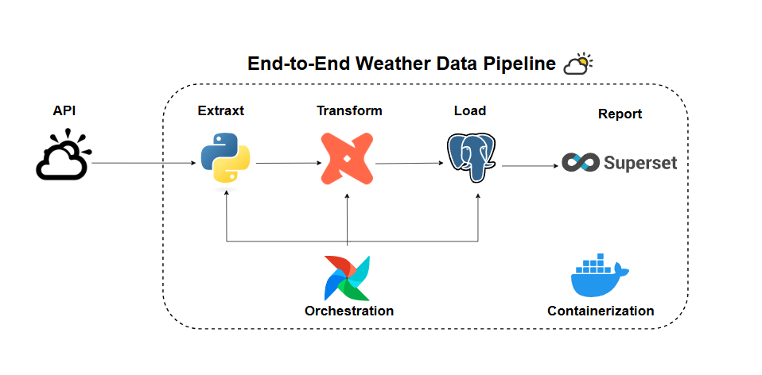

# 🌤️ Weather Data Pipeline Project

A complete **end-to-end Data Engineering pipeline** that automates **weather data collection, transformation, modeling, and visualization** using **Python, DBT, Airflow, PostgreSQL, Docker, and Apache Superset**.

---

## 🧩 Project Overview

This project automatically:
- Fetches real-time weather data from the **Open-Meteo API**
- Cleans and transforms it using **Pandas**
- Loads it into a **PostgreSQL** database
- Models and aggregates it using **DBT**
- Automates all tasks with **Airflow**
- Visualizes insights through **Apache Superset** dashboards

---

## ⚙️ Project Structure

.
├── README.md
├── airflow/
│ └── dags/
├── api-request/
│ ├── api_request.py
│ ├── insert_records.py
│ └── transform_data.py
├── dbt/
│ ├── my_project/
│ ├── logs/
│ └── profiles.yml
├── docker/
│ ├── docker-bootstrap.sh
│ ├── docker-init.sh
│ └── superset_config.py
├── docker-compose.yml
├── docs/
│ ├── dashboard/
│ └── images/
│ └── weather-data.png
├── logs/
│ └── dbt.log
├── postgres/
│ ├── airflow_init.sql
│ └── superset_init.sql
└── venv/
├── bin/
├── lib/
└── pyvenv.cfg

## 🚀 Quick Start — Run the Full Pipeline

### 🪄 1. Clone the Repository
bash
git clone https://github.com/noran-salm/weather-data-project.git
cd weather-data-project
🐳 2. Start the Environment with Docker
bash
Copy code
docker-compose up --build
This will start:

PostgreSQL

Apache Airflow

DBT container

Apache Superset

💡 Wait 2–3 minutes for all services to initialize.

🧭 3. Access Services
Service	URL	Default Credentials
Airflow	http://localhost:8080	admin / (password shown in terminal)
Superset	http://localhost:8088	admin / 123456

⚙️ 4. Initialize Superset (First Time Only)
bash
docker exec -it superset_container superset fab create-admin
docker exec -it superset_container superset db upgrade
docker exec -it superset_container superset init
🧠 5. Run the Pipeline
🟢 Option 1 — From Airflow
Open Airflow UI → DAGs

Enable weather-api-dbt-orchestrator

Click Trigger DAG

🟣 Option 2 — Manually
bash
docker exec -it airflow_container python /opt/airflow/api-request/insert_records.py
docker exec -it dbt_container dbt run

📊 6. View Dashboards in Superset

Open http://localhost:8088
→ Dashboards → Weather Report
→ Enjoy your live weather analytics!

💡 Optimization & Recommendations
Area	Recommendation
API Efficiency	Cache or limit API calls to reduce network cost
Database Performance	Add indexes on city and weather_time_local
Airflow Scheduling	Run the DAG hourly or daily depending on update frequency
DBT Models	Use incremental models instead of full reloads
Monitoring	Add Slack/email alerts for failed Airflow tasks
Superset UX	Add city/date filters for better interactivity

🖼️ Adding Images to README
Place your screenshots inside:

bash
docs/images/
Example:

bash
docs/images/weather-data.png
docs/images/dashboard_trend.png
Add them to the README using Markdown:

markdown
Copy code

Then commit and push:

bash
Copy code
git add README.md docs/images/*
git commit -m "Add dashboard screenshots"
git push origin main
📚 References
🌦 Open-Meteo API Documentation

🪶 Apache Airflow Docs

📊 DBT Core Docs

📈 Apache Superset Docs

🐳 Docker Documentation

🧾 License
MIT License © 2025 Noran Salm
